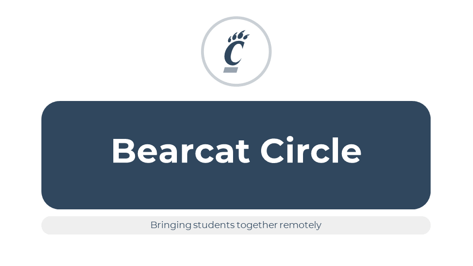

# Bearcat Circle

#### Team members
* Nathan Berning - Computer Science (berninnt@mail.uc.edu)
* Ryan Gruss - Computer Science (grussra@mail.uc.edu)
* Simranjit Singh - Computer Engineering (singh2s7@mail.uc.edu)
* Giang Ta - Computer Science (tagh@mail.uc.edu)

#### Faculty Advisor
Yizong Cheng (chengy@ucmail.uc.edu)

## Table of Contents

#### Abstract
Bearcat Circle is a Web application that aims to simulate the in-person learning experience and aid with remote 
learning. The application combines existing communication software all into one easy-to-use package. Students can post 
discussions, chat with other students and much more. Bearcat Circle makes it easy for students to explore and branch 
out of their existing circle.

#### Description
The Cincy Study platform uses web frameworks to create a website that allows for improved communication in a remote 
environment. The platform uses a login page along with separate pages for specific features like groupchats, classes, 
etc. The platform will feature a homepage which will have all the core components of the platform on one 
main page. Each classroom/feature will have its own respective page for the best user experience. With all of these 
pages and features we hope to create a positive learning community for students from anywhere in the world.

#### User Interface Specification (Todo)

#### Test Plan and Results (Todo)

#### User Manual (Todo - update userdocs)

#### Project Video

#### [Project Slides](https://mailuc-my.sharepoint.com/:p:/g/personal/singh2s7_mail_uc_edu/EV661Rpdl2JMjfhcG8rvtCgBSVnb7jVXbK0Uxi4Cccd_lg?e=rqJm1A)

#### [Project Poster](https://github.com/S1mS1ngh/senior-design/blob/master/Final_Materials/BearcatCirclePoster.pdf)

#### Assessments (Todo)
* [Initial Self-Assessments](https://github.com/S1mS1ngh/senior-design/tree/master/Individual_Capstone_Assessment/Initial)
    * [Nathan Berning](https://github.com/S1mS1ngh/senior-design/blob/master/Individual_Capstone_Assessment/Initial/Individual_Assessment_NathanBerning.md)
    * [Ryan Gruss](https://github.com/S1mS1ngh/senior-design/blob/master/Individual_Capstone_Assessment/Initial/IndividualCapstoneAssessment_RyanGruss.md)
    * [Simranjit Singh](https://github.com/S1mS1ngh/senior-design/blob/master/Individual_Capstone_Assessment/Initial/Individual_Assessment_SimSingh.md)
    * [Giang Ta](https://github.com/S1mS1ngh/senior-design/blob/master/Individual_Capstone_Assessment/Initial/Individual_Assessment_GiangTa.md)
* [Final Self-Assessments]
    * [Nathan Berning]
    * [Ryan Gruss]
    * [Simranjit Singh]
    * [Giang Ta]

#### [Summary of Hours and Justification (Todo)](https://github.com/S1mS1ngh/senior-design-fall-2020/blob/master/Resources/Team-Hours.md)
* [Nathan Berning]
* [Ryan Gruss]
* [Simranjit Singh]
* [Giang Ta]

### Appendix
#### Topic Area
Online Student Learning Community

### User Stories and Design Diagrams
* [User Stories](https://github.com/S1mS1ngh/senior-design-fall-2020/blob/master/User_Stories.md)
* [Design Diagrams](https://github.com/S1mS1ngh/senior-design-fall-2020/tree/master/Design_Diagrams)
    * [Level 0](https://github.com/S1mS1ngh/senior-design-fall-2020/blob/master/Design_Diagrams/d0.png)
    * [Level 1](https://github.com/S1mS1ngh/senior-design-fall-2020/blob/master/Design_Diagrams/D1.png)
    * [Level 2](https://github.com/S1mS1ngh/senior-design-fall-2020/blob/master/Design_Diagrams/D2.png)
* [Diagram Descriptions](https://github.com/S1mS1ngh/senior-design-fall-2020/blob/master/Design_Diagrams/Diagram-Descriptions.md)

### Project Tasks and Timeline
* [Task List](https://github.com/S1mS1ngh/senior-design-fall-2020/blob/master/Tasklist.md)
* [Timeline](https://github.com/S1mS1ngh/senior-design-fall-2020/blob/master/Timeline.md)
* [Effort Matrix](https://github.com/S1mS1ngh/senior-design-fall-2020/blob/master/Effort-Matrix.pdf)

### [ABET Concerns](https://github.com/S1mS1ngh/senior-design-fall-2020/blob/master/Major-Constraints.md)

### [Professional Biographies](https://github.com/S1mS1ngh/senior-design-fall-2020/tree/master/Professional_Bio)

* [Resources](https://github.com/S1mS1ngh/senior-design-fall-2020/tree/master/Resources)
