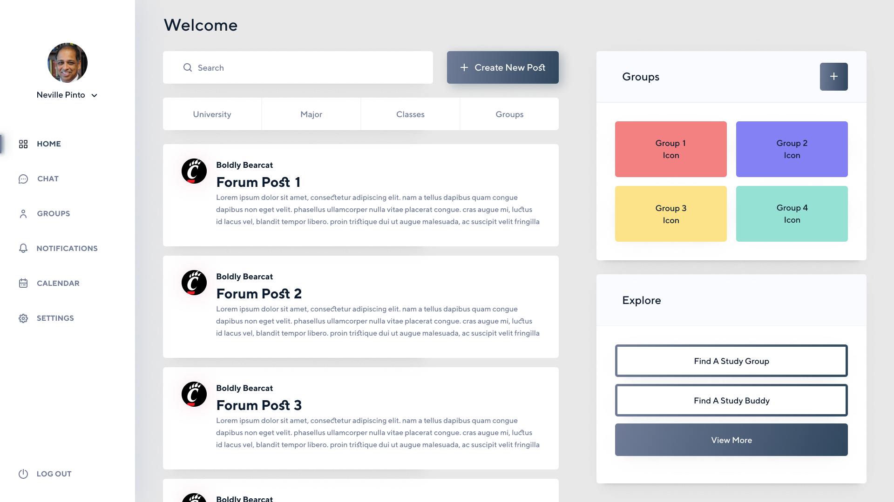

# User Documentation and Manual

Cincy study is a platform that provides students the communication they need when being remote.

Features:
- Messaging (1:1 and Group)
- Communities
- Matching

## Getting Started
What is Cincy Study?

Cincy study aims to improve student engagement and interactions virtually and aid with remote learning. Since the start
of the pandemic, classes have been significantly less interactive, which can make it more difficult for students to 
learn and succeed. It can also be hard for students to find others to work with. To tackle this problem, we’re 
creating an easily accessible online platform that combines the functionality of multiple student tools for learning 
and communication. Our app will help students meet others, study for their classes and collaborate with other 
students while also providing incentive for students.

How to access: 

Accessing Cincy Study is easy, simply go to http://cincystudy.com

Continue through the rest of the User Docs to get a walk-through of the platform.

## Signing up

## Logging in

## Create new chat

## Create new group

## FAQ