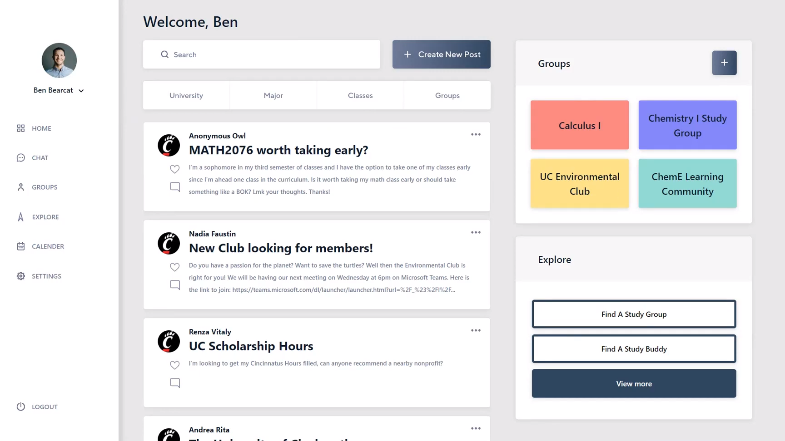
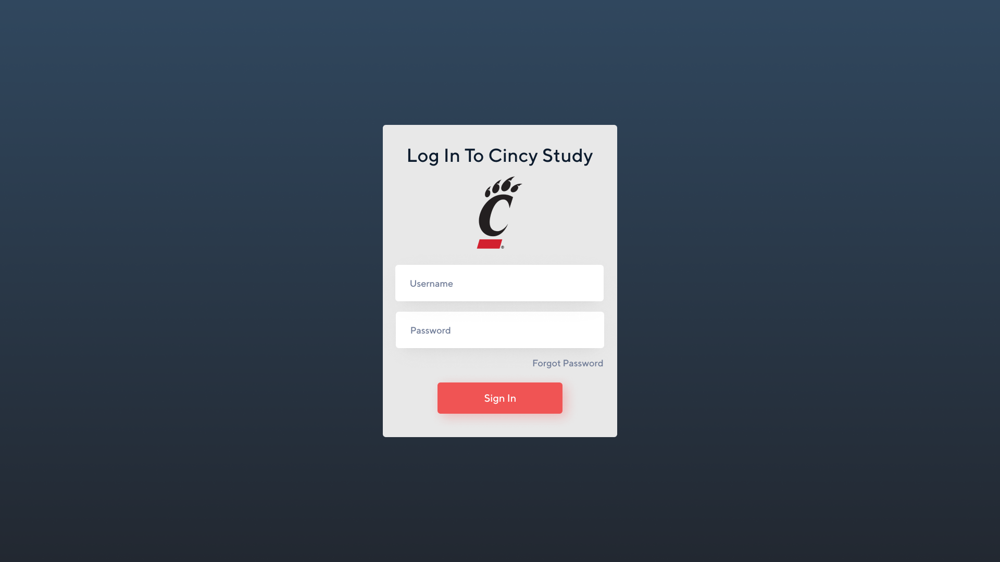
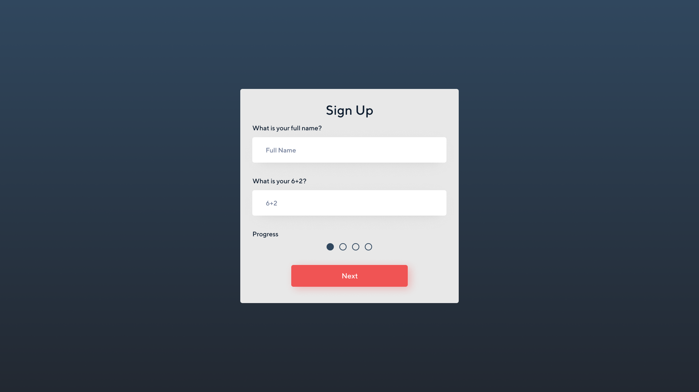
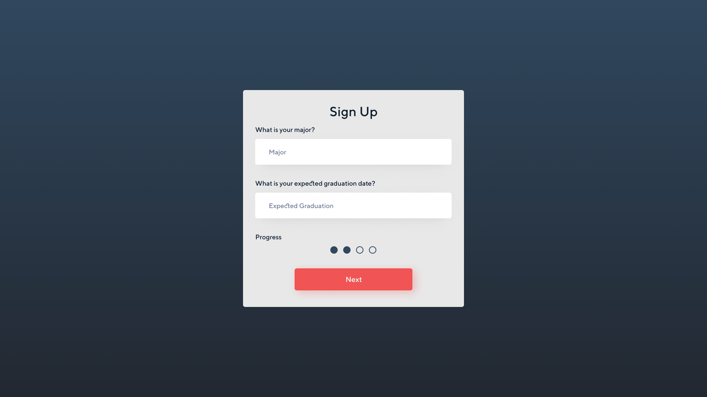
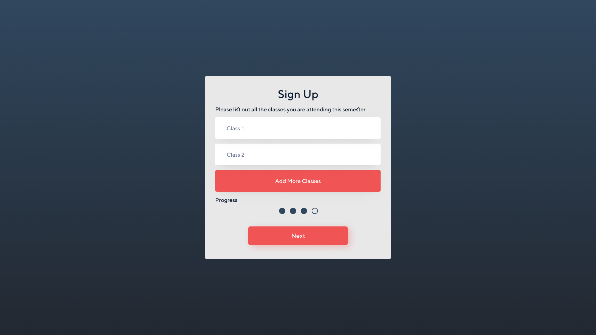
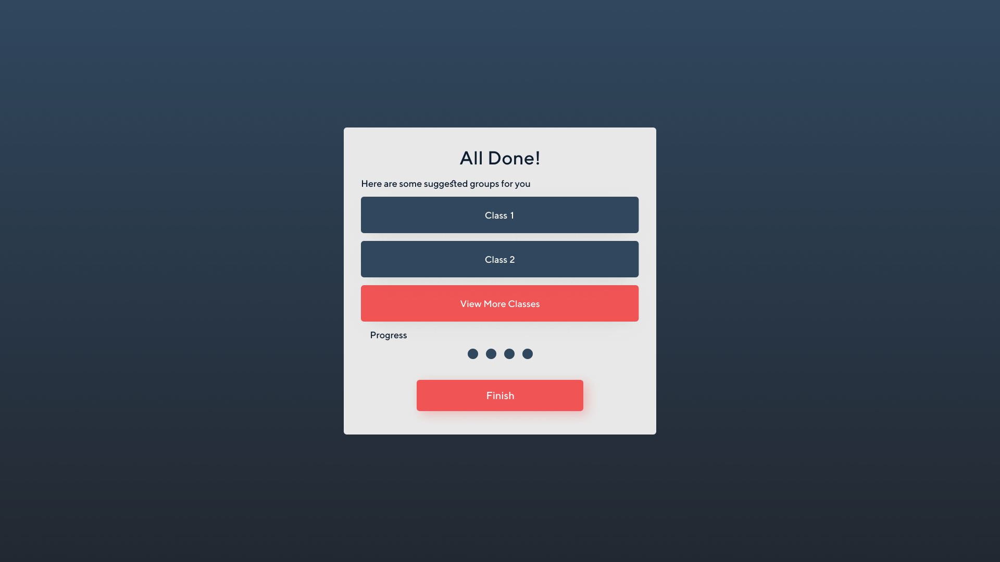
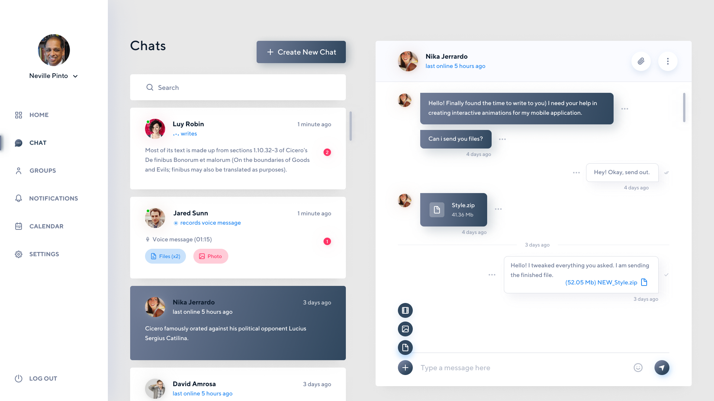
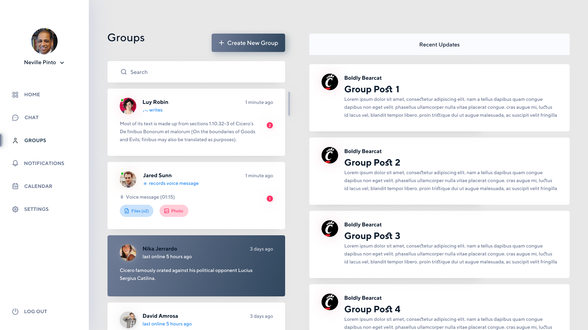

# User Documentation and Manual

Cincy study is a platform that provides students the communication they need when being remote.

Features:
- Messaging (1:1 and Group)
- Communities
- Matching

## Getting Started
What is Cincy Study?

Cincy study aims to improve student engagement and interactions virtually and aid with remote learning. Since the start
of the pandemic, classes have been significantly less interactive, which can make it more difficult for students to 
learn and succeed. It can also be hard for students to find others to work with. To tackle this problem, we’re 
creating an easily accessible online platform that combines the functionality of multiple student tools for learning 
and communication. Our app will help students meet others, study for their classes and collaborate with other 
students while also providing incentive for students.

How to access: 

Accessing Cincy Study is easy, simply go to http://cincystudy.com

Continue through the rest of the User Docs to get a walk-through of the platform.

## Logging in
As your browser reaches the domain of Cincy Study, you will be brought up to the login interface.

This is where you will enter your credential if you have a UC account that has been registered in our system. If successful, the app will redirect you back to the app main page for further interaction.

If you have not registered an account with us, you may click "Register an account" option below the box in order to create an account.

## Signing up
Upon registering, Cincy Study will ask for your full name and UC 6+2 account to make sure that you're a student attending UC.

You will have to declare your major and expected graduation date.

This is optional but you will have to state classes that you're currently taking in the semester in order for better recommendation of related channels of your interest.

Cincy Study offers you some possible channels of your choice of classes that you might be interested and you are good to go with your new account.

## Create new chat

The Chat Page will allow you to reach out and communicate directly to another person signed up through Cincy Study. To start a chat with someone, all you have to do is hit the "Create New Chat" button and type the name of someone you would like to communicate with. Then type your message and hit send! Once you have sent/received some messages, you will be able to select different chats from different people by just clicking on the chat itself.

## Create new group

The Groups Page will allow you to communicate with more than one person in a more broad sense. The Group Page will act as a kind of forum, where you can chat with a multitude of people instead of just one person. Once you are in more than one group, you will just click on the different groups in order to look at other group posts, create a group post, or interact with other group posts. To create a new group, all you need to do is click the "Create New Group" button and follow the steps.

## FAQ
### Am I able to edit my profile?
Your profile, mainly name and photo, will be pulled from the information linked to your UC 6 + 2 credentials. This is to prevent students from setting inappropriate
names and images on their profile.

### Is there a limit to the number of groups I can create or join?
Nope, your able to be a part of as many groups as you like! You can even create groups with students outside of your major!

### Is there a limit to the number of forums I can create?
Again nope, create as many as you want!

### What if I do not have a UC account yet?
You will have to wait until your UC account is created before signing up for Cincy Study.

### Is there an APP for Cincy Study?
Currently there is no APP for Cincy Study.

