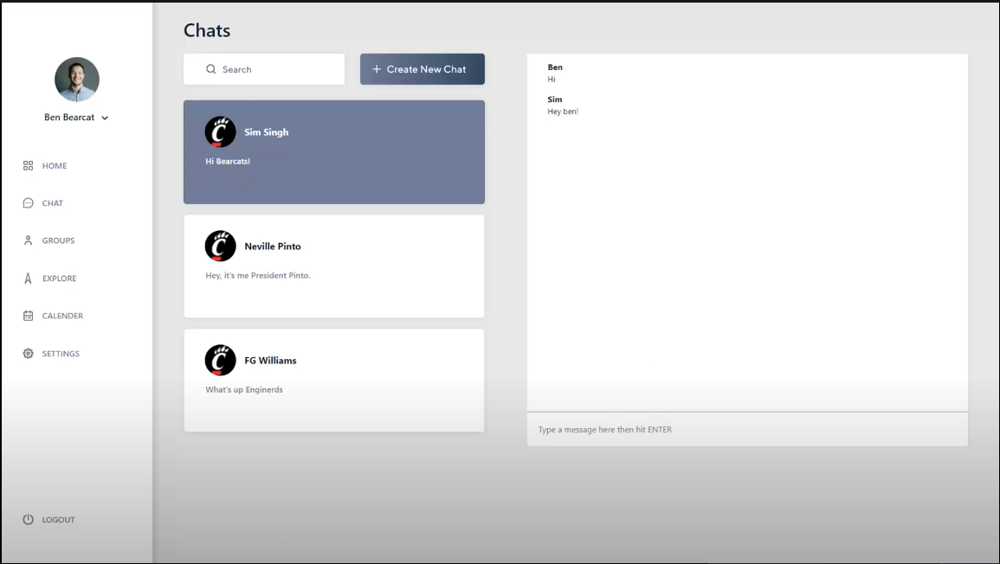
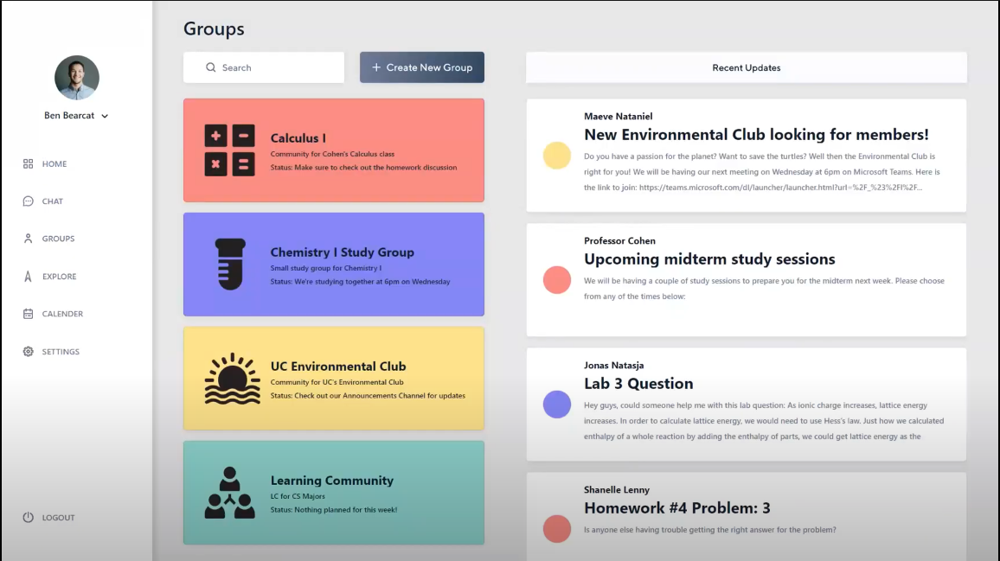
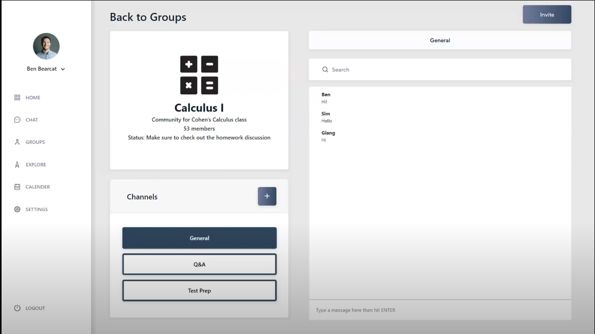
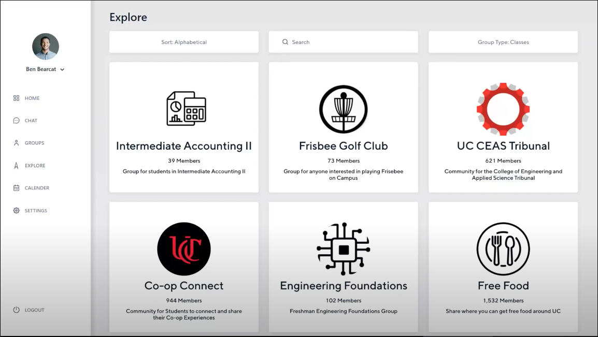
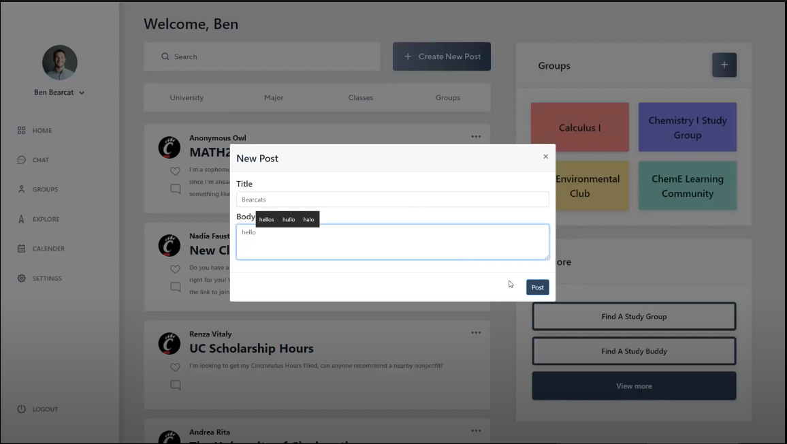
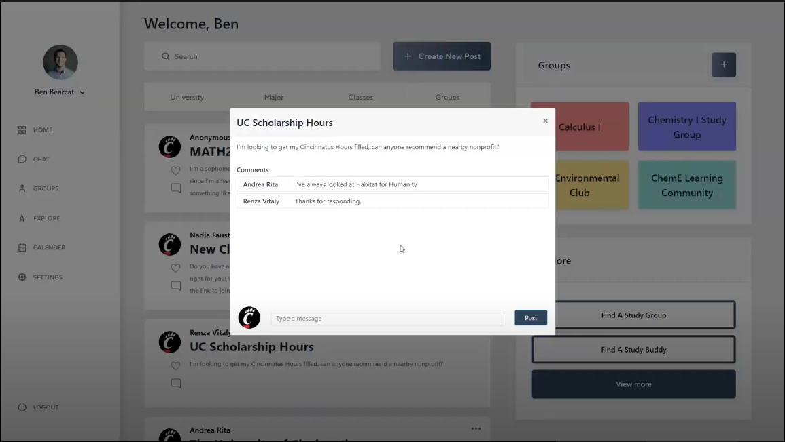

# User Documentation and Manual

Bearcat Circle is a platform that provides students the communication they need when being remote.

Features:
- Communities
- Forum
- Messaging

## Getting Started
What is Bearcat Circle?

Bearcat Circle is a Web application that aims to simulate the in-person learning experience and aid with remote 
learning. The application combines existing communication software all into one easy-to-use package. Students can post 
discussions, chat with other students and much more. Bearcat Circle makes it easy for students to explore and branch 
out of their existing circle.

## Logging in
As your browser reaches the domain of Bearcat Circle, you will be brought up to the login interface.

This is where you will enter your credential if you have a UC account that has been registered in our system. If successful, the app will redirect you back to the homepage for further interaction.

If you have not registered an account with us, you may click "Register an account" option below the box in order to create an account.

## Signing up
Upon registering, you will enter for your full name and UC 6+2 account to make sure that you're a student attending UC.

You will have to declare your major and expected graduation date.

This is optional but you will have to state classes that you're currently taking in the semester in order for better recommendation of related channels of your interest.

Bearcat Circle offers you some possible channels of your choice of classes that you might be interested and you are good to go with your new account.

## Create new chat

The Chat Page will allow you to reach out and communicate directly to another person signed up through Bearcat Circle. To start a chat with someone, all you have to do is hit the "Create New Chat" button and type the name of someone you would like to communicate with. Then type your message and hit send! Once you have sent/received some messages, you will be able to select different chats from different people by just clicking on the chat itself.

## Select group chat

The Groups page will allow user to select current groups that they're participating in and interact with other members in the group chat. This page also aggregates the latest message or notification from these groups.

## Engage in group chat

After selecting the group user want to engage in conversation in Group Selection page, user will be taken to the group chat page where all basic chat functionalities are provided and the group chat also manages several sub-channel for conversations on different topics.

## Exploration Section

Beside private groups that you create or are invited in, there are also a wide selection of other groups that are made public and will always available in the explore section for you to join if interested. This could include from school organizations, student clubs to student hosted events.

## Create Forum Post

In the main page, not only you can view other discussions on the forum, you can also create your own discussion with suitable tags such as Biology or Computer Science if you want your post to be visible to people in the majors to participate in. 

## Comment Forum Post

In order to participate in a discussion made by you or others on the platform, you can comment directly into the post and the comment will be updated for everyone to see.

## FAQ
### Am I able to edit my profile?
We currently don't support editing profiles after signup.

### Is there a limit to the number of groups I can create or join?
Nope, your able to be a part of as many groups as you like! You can even create groups with students outside of your major!

### Is there a limit to the number of forum posts I can create?
Again nope, create as many as you want!

### What if I do not have an account yet?
You will have to wait until your account is created before accessing Bearcat Circle.

### Is there an APP or Mobile version for Bearcat Circle?
Currently there is no mobile compatibility for Bearcat Circle.

